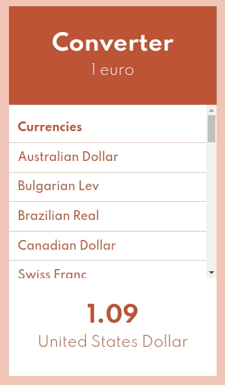

# Convertisseur

## Objectif du projet étudiant

Réaliser ce projet React depuis zéro. Il s'agit d'un convertisseur euro/autre devise. Le projet ne demande pas d'entrées d'utilisateur et les taux de conversions sont fixes et stockées dans un  fichier dédié.

## Objectif personnel

Je souhaiterai rendre ce convertisseur fonctionnel. Pour cela, je vais faire en sorte de proposer à un utilisateur d'entrer la somme en euros qu'il souhaiterait convertir, lui permettre de sélectionner une devise et afficher dynamiquement le résultat en fonction du taux actuel.

### Étapes à valider

- Pouvoir récupurer l'entrée utilisateur
- s'en servir pour afficher dynamiquement un résultat en fonction des données fixes mises à disposition dans le fichier src/data/currencies.js
- Fetcher une API dédiée aux taux de conversions actuel.
